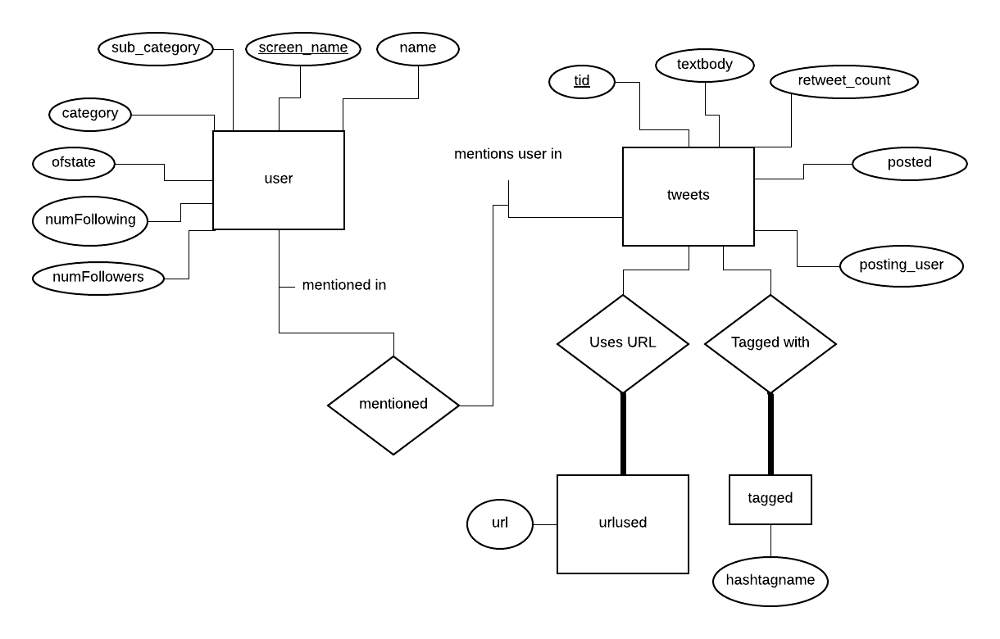

# 363 Project Set up

Requirements:

- Docker
- Docker compose
- Python(The requirement to install Docker compose)

> If you install Docker on Windows or Mac, docker compose will be installed with your docker.

## ER Diagram



## Data import script

The data import script is under the import-data folder

## What's more!

You can check the running version of the the webapp: http://ec2-18-206-39-47.compute-1.amazonaws.com:8080/webapp/

## What's included?

The docker-compose will automatically start a jsp server and a local database server. Everything you need will be automatically created for you.

## Installation

### Important

Now you can use the latest GUI to start up the docket.
Just click on the RunDocker.jar, then follow the instructions,
the environment will be automatically set up for you.

### Step one

clone this repostory and then open a terminal in the project folder. If you on windows, first insider the folder, then shift + right click, open a power shell. If you on Mac OS, right click the project, select service, open a terminal.

### Step two

Linux/Mac OS

```
sudo docker-compose up -d jsp
sudo docker-compose up -d mysql
```

> If you need to import the data into the database, you can try to use sudo docker-compose run import_data. Remember run this command after the running the commands above.

Windows

```
docker-compose up -d jsp
docker-compose up -d mysql
```

import data
```
docker-compose run import_data
```


### Step three

Open a web browser, then go to localhost:8080/webapp to see the helloworld page.

> If you on Mac OS, you need to go to 0.0.0.0:8080/webapp to see the helloworld page.


## If you not using docker

## Step 1
First install python3.6 or higher, put everything under the jsp folder to your tomcat webapps/webapp folder

## Step 2
Open a terminal in your import-data folder
On windows:
Run
```
pip install pandas
pip install tqdm
pip install mysql-connector-python
pip install colored
```
On Mac:
```
pip3 install pandas
pip3 install tqdm
pip3 install mysql-connector-python
pip3 install colored
```

## Step3
On windows
Run
```
python import_data.py
```
On Mac:
```
python import_data.py
```


### Optional: Auto reload

Run

```
pip install watchdog
```

then run

```
python auto_reload.py
```

to get hot reload function on docker.

## How to modify?

> Update the page

Put everything under the jsp folder.

> Local database's data

Every data is under the sql/db-storage.

## Warning

If you using Docker for the sql server, make sure your host ip is mysql:3306, not localhost:3306 or something else. This is the default ip address for everything running inside the docker container. Same for the import python script.
